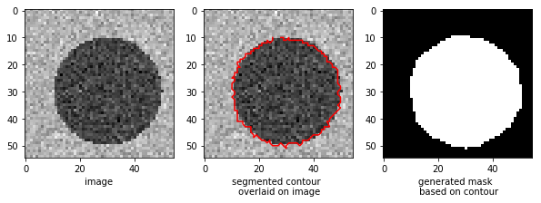

### Closed-contour segmentation using graph theory and dynamic programming
#### Usage.
    
see `demo.ipynb` for usage.

    # get contour coordinates and mask from demo image
    px,py,mask = get_closed_contour(testimg)

#### Reference.

Chiu SJ, Toth CA, Rickman CB, Izatt JA, Farsiu S. Automatic segmentation of closed-contour features in ophthalmic images using graph theory and dynamic programming. Biomedical optics express. 2012 May 1;3(5):1127-40.

https://www.ncbi.nlm.nih.gov/pmc/articles/PMC3342188/?report=classic